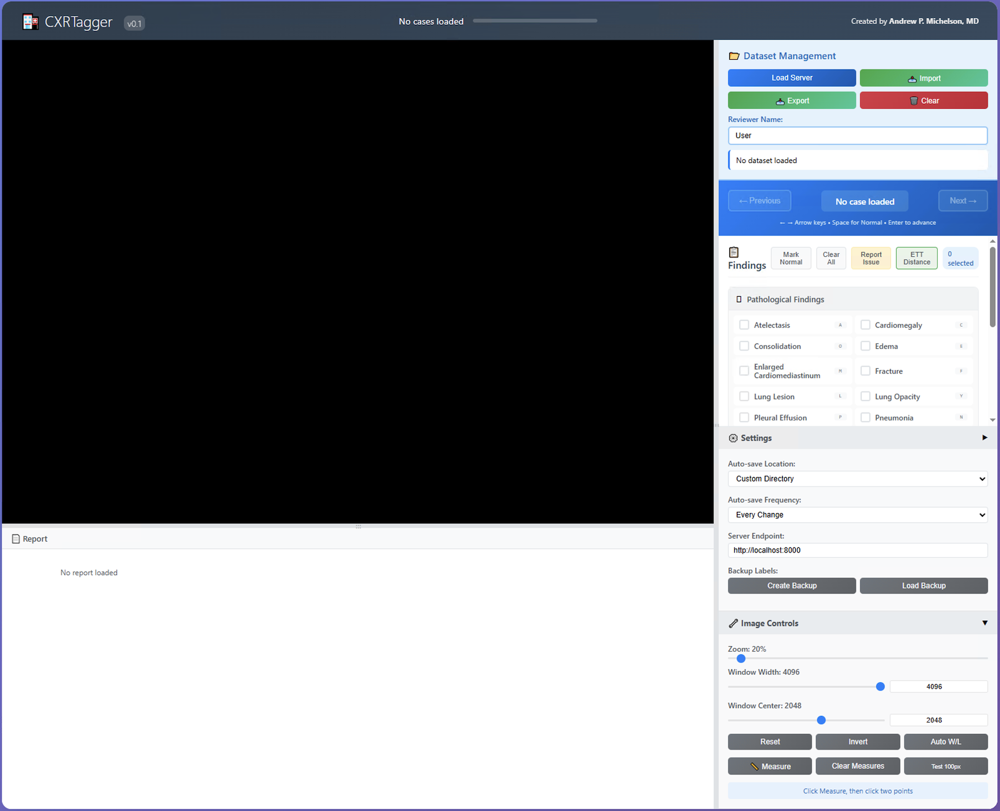

# CXRTagger

CXRTagger  is a lightweight, browser-based application for structured review and labeling of large quantities of chest X-rays. 

* DICOM-compatible viewer with window/level controls
* Radiology report viewing capabilities (optional)
* Real-time multi-label annotation across 18 radiographic findings
* Customizable UI and auto-saving to JSON
* Ideal for dataset curation, training label generation, or ground truth review

  

	  <b>Supported Labels</b>
  

Pathology - derived from CheXpert [ ]:

* Atelectasis

* Cardiomegaly

* Consolidation

* Edema

* Enlarged Cardiomediastinum

* Fracture

* Lung Lesion

* Lung Opacity

* Pleural Effusion

* Pneumonia

* Pneumothorax

* Pleural Other

Support Devices:

* Endotracheal Tube

* Tracheostomy

* Central Venous Catheter (CVC)

* Chest Tube

* Nasogastric Tube (NG Tube)

  

	  <b>Data Preparation</b>
  

	The JSON that directs the webapp to the specific files should have the following structure:
	
		{
		  "caseID01": {
		    "image": "/absolute/path/to/case_001.dcm",
		    "report": "/absolute/path/to/case_001_report.txt"
		 }
}

## Example Usage
	git clone https://github.com/your_org/cxrstudio.git
	
	cd cxrstudio
	
	pip install -r requirements.txt
	
	python server_setup.py --json dataset.json

Navigate to <http://localhost:8000/CXRTagger.html>

Click **“Load from Server”** to begin reviewing.

## Issues
Please open new issues with the codebase or report issues directly to <amichels@wustl.edu>.

## References:
Jeremy Irvin, Pranav Rajpurkar, Michael Ko, Yifan Yu, Silviana Ciurea-Ilcus, Chris Chute, Henrik Marklund,Behzad Haghgoo, Robyn Ball, Katie Shpanskaya, et al. CheXpert: A large chest radiograph dataset with uncertainty labels and expert comparison. In Thirty-Third AAAI Conference on Artificial Intelligence, 2019.

## Disclaimer
*CXRTagger is intended for research, educational, and development purposes only.
This tool is not a medical device and has not been approved for clinical use. It should not be used to diagnose, treat, or manage patients. Users are responsible for complying with all applicable laws, regulations, and institutional policies regarding medical data handling and human subject research. Use at your own discretion. Not responsible for any outcomes related to the use of this tool.*

## License
CC BY-NC-SA 4.0.